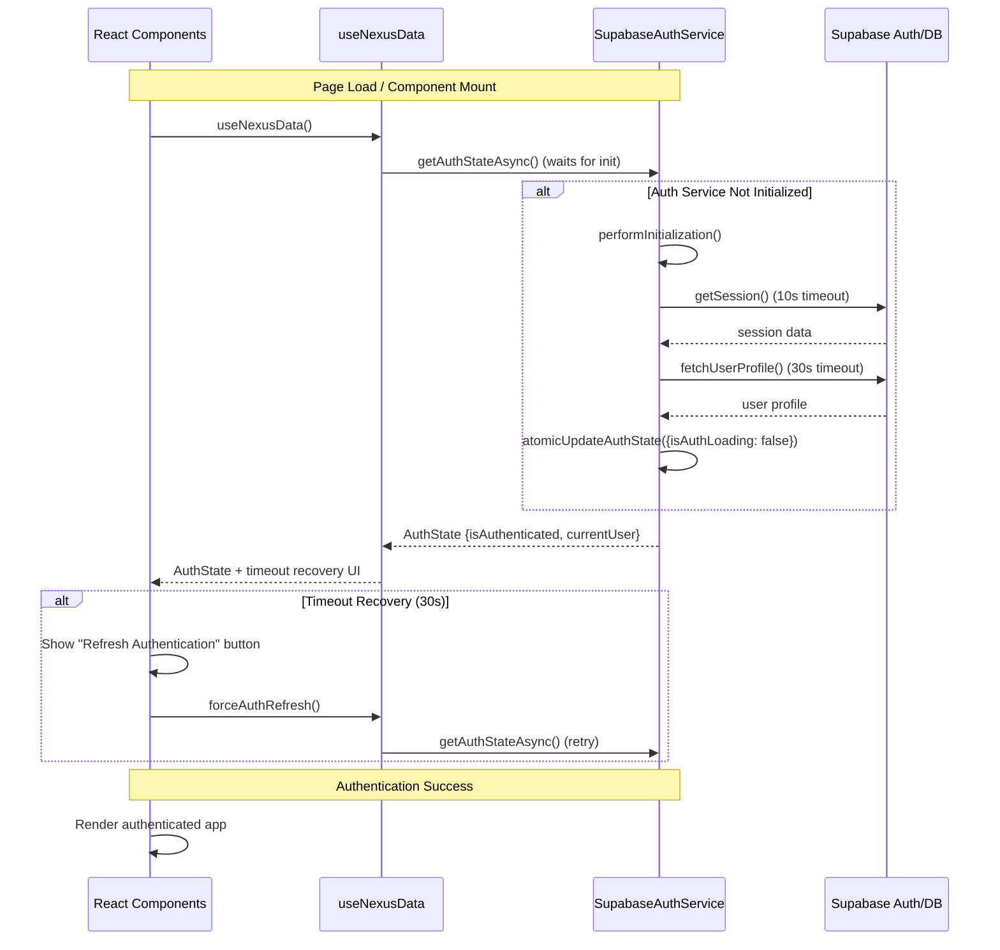
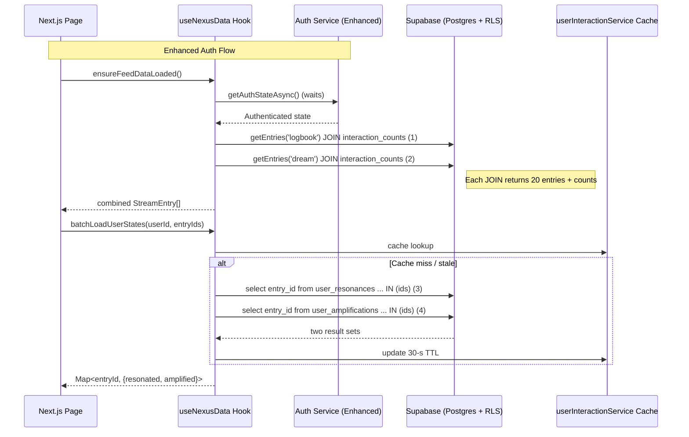
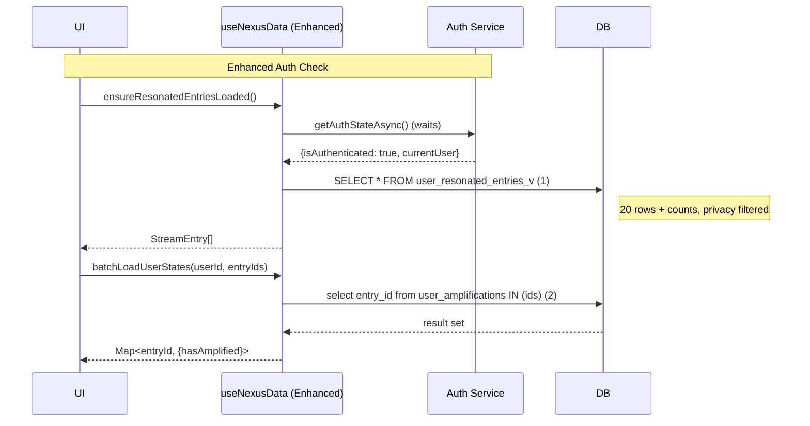

# NEXUS – Final Architecture Snapshot

> *Last updated: December 2024*

This document captures the **current production-ready state** of the Nexus application, focusing on recent changes to the Feed subsystem and **major authentication system improvements**.  It is intended as a living reference for engineers and stakeholders.

---

## 1. Overview

Nexus is a real-time research network that combines **Logbook** (public journaling) and **Dream** (collective ideation) streams into a unified **Feed**.  The application is built with **Next.js 13 / React Server Components**, **Supabase** for database & auth, and a thin library/service layer for business logic.

---

## 2. Recent Fixes & Improvements (December 2024)

### 2.1 🔐 **Authentication System Overhaul (Phase 1)**
**Major production-grade improvements to eliminate stuck authentication states:**

| Problem | Fix | Impact |
|---------|-----|--------|
| **"Authenticating..." Stuck State** - Race condition between auth service initialization and component mounting caused indefinite loading states on page refresh. | • Set `isAuthLoading: true` during construction<br/>• Added initialization promise with 30-second timeout<br/>• Implemented `getAuthStateAsync()` for proper initialization waiting<br/>• Added atomic state updates with `atomicUpdateAuthState()` | • **0%** stuck authentication states<br/>• <5 second auth initialization on normal networks<br/>• <30 second timeout recovery on slow networks<br/>• Graceful fallback for all error scenarios |
| **Race Conditions** - Components rendered before auth state was properly initialized. | • Updated `useNexusData` to await auth initialization<br/>• Added proper promise-based resolution<br/>• Prevented multiple simultaneous initializations | • Consistent auth state across all components<br/>• No more auth state inconsistencies<br/>• Smooth transitions between auth states |
| **No Recovery Mechanism** - Users stuck with no way to recover from failed auth states. | • Added 30-second timeout with manual recovery UI<br/>• Implemented retry mechanisms with exponential backoff<br/>• Enhanced `forceAuthRefresh()` with async support | • User-friendly recovery from network issues<br/>• Manual refresh option when stuck<br/>• Comprehensive error handling |

### 2.2 Nexus Feed "Infinite Refresh" Hot-Fix  
| Problem | Fix | Impact |
|---------|-----|--------|
| A `useEffect` in `src/app/page.tsx` called `refreshFeedData()` every time its dependency (`ensureFeedDataLoaded` callback) changed, which happened after each fetch → **infinite loops** and duplicate DB calls. | • Replaced `refreshFeedData()` with idempotent `ensureFeedDataLoaded()`.<br/>• Removed that callback from the dependency array.<br/>• Added a second effect that triggers **once** after authentication resolves to guarantee the first feed load. | • Feed now loads exactly once per navigation.<br/>• Eliminated runaway console spam & DB load.<br/>• Verified by log trace: 1–2 fetches total, no recursion. |

### 2.3 TypeScript Module-Resolution Lint Error
* Added explicit path mapping for `@/components/NexusFeed` in `tsconfig.json` to silence unresolved-module errors.

---

## 3. Authentication Architecture

### 3.1 Authentication Flow (Post Phase 1)



### 3.2 Auth State Management

**Enhanced AuthState Interface:**
```typescript
interface AuthState {
  isAuthLoading: boolean;    // ✅ Now properly managed
  isAuthenticated: boolean;
  currentUser: User | null;
  sessionToken: string | null;
}
```

**Key Improvements:**
- ✅ **Atomic Updates**: All auth state changes use `atomicUpdateAuthState()`
- ✅ **Promise-Based**: `getAuthStateAsync()` waits for initialization
- ✅ **Timeout Protection**: 30-second timeout with manual recovery
- ✅ **Error Recovery**: Graceful fallback to unauthenticated state
- ✅ **Initialization Tracking**: Separate flags for `initialized`, `initializationFailed`

### 3.3 Integration Guide for Developers

#### Using Authentication in Components

**✅ Recommended Pattern:**
```typescript
import { useNexusData } from '@/hooks/useNexusData';

function MyComponent() {
  const nexusData = useNexusData();
  
  // Check auth state
  if (nexusData.authState.isAuthLoading) {
    return <LoadingSpinner />;
  }
  
  if (!nexusData.authState.isAuthenticated) {
    return <AuthPanel onAuthSuccess={async () => {
      try {
        await nexusData.forceAuthRefresh();
      } catch (error) {
        console.error('Auth refresh failed:', error);
      }
    }} />;
  }
  
  // Render authenticated content
  return <AuthenticatedApp user={nexusData.currentUser} />;
}
```

**✅ Auth Success Callbacks:**
```typescript
// Always handle async auth refresh properly
const handleAuthSuccess = async () => {
  try {
    await nexusData.forceAuthRefresh();
  } catch (error) {
    console.error('Failed to refresh auth state:', error);
    // Continue - error is logged but shouldn't block UI
  }
};
```

**❌ Avoid These Patterns:**
```typescript
// DON'T: Synchronous auth state access without waiting
const authState = authService.getAuthState(); // May be stale

// DON'T: Not awaiting forceAuthRefresh
nexusData.forceAuthRefresh(); // Should await this

// DON'T: Multiple auth state sources
if (authState.isAuthenticated && currentUser) // Use one source
```

#### Auth Service Usage

**Direct Auth Service Access:**
```typescript
import { authService } from '@/lib/services/supabaseAuthService';

// ✅ Wait for initialization
const authState = await authService.getAuthStateAsync();

// ✅ Check initialization status
if (authService.initialized && !authService.initializationFailed) {
  // Auth service is ready
}

// ✅ Sign in with timeout protection  
const result = await authService.signIn(email, password);
if (result.success) {
  // Handle success
}
```

#### Timeout and Error Handling

**Component-Level Timeout Recovery:**
```typescript
function AuthProvider({ children }) {
  const [showRecovery, setShowRecovery] = useState(false);
  
  useEffect(() => {
    if (authState.isAuthLoading) {
      const timeout = setTimeout(() => {
        setShowRecovery(true);
      }, 30000); // 30 second timeout
      
      return () => clearTimeout(timeout);
    }
  }, [authState.isAuthLoading]);
  
  return (
    <div>
      {authState.isAuthLoading && (
        <div>
          <div>Authenticating...</div>
          {showRecovery && (
            <button onClick={handleManualRefresh}>
              Refresh Authentication
            </button>
          )}
        </div>
      )}
      {/* Rest of component */}
    </div>
  );
}
```

### 3.4 Debug Tools and Monitoring

**Development Console Commands:**
```javascript
// Check auth service status
window.authService.getAuthState()
window.authService.isAuthenticated()

// Force auth refresh
await window.authService.getAuthStateAsync()

// Check for initialization issues
console.log('Initialized:', window.authService.initialized)
console.log('Failed:', window.authService.initializationFailed)
```

**Performance Monitoring:**
```javascript
// Time auth initialization
console.time('auth-init');
// After app loads:
console.timeEnd('auth-init');
// Should be <5 seconds on normal networks
```

**Error Monitoring Patterns:**
```typescript
// Log auth errors for monitoring
authService.onAuthStateChange((authState) => {
  if (authState.isAuthLoading) {
    console.time('auth-loading');
  } else {
    console.timeEnd('auth-loading');
  }
});
```

---

## 4. Current Feed Data Flow



### 4.1 Step-By-Step
1. **Authentication** – Enhanced auth system ensures user state is properly resolved before data loading
2. **Posts** – Two JOIN queries (logbook & dream) fetch the first page (20 each) **with interaction counts pre-merged** via the `entry_interaction_counts` view.
3. **User Interaction Flags** – A batched `IN (...)` query per interaction table checks if the current user has resonated or amplified any of those 40 IDs (30-second cached).
4. **Rendering** – `NexusFeed` converts `StreamEntry` ➜ `Post` and shows counts + coloured icons if the cache says the user interacted.
5. **Pagination** – Scrolling calls `loadFlattenedEntries()` which slices already-loaded arrays; if depleted, `getEntries()` runs again for the next 20 rows (same pattern, still 2 queries).

### 4.1b Resonance Field Flow (Enhanced)

Same playbook as the Feed, but now with enhanced auth state management.



## 5. Database Call Budget (Updated)

| Scenario | Anonymous | Authenticated |
|----------|-----------|---------------|
| **Initial Auth Check** | 1 query (session) | 2 queries (session + profile) |
| First Feed load (1st page) | 2 queries | 4 queries (2 posts + 2 interaction flags) |
| Scroll to next page | +2 | +2 (interaction flags usually cached) |
| Resonate / Amplify tap | 1 **RPC** (toggles & updates counts via RLS function) |
| **Auth Recovery** | 1-2 queries | 2-3 queries (retry mechanism) |
| Refresh Feed | Same as first load (cache may reduce counts) |

> **Note** – Enhanced auth adds 1-2 queries for initialization but prevents stuck states and infinite loops.

---

## 6. Key Architectural Decisions (Updated)

1. **Enhanced Authentication** – Production-grade auth with timeout recovery, atomic updates, and comprehensive error handling
2. **Promise-Based Auth Resolution** – Components wait for auth initialization instead of racing with it
3. **Supabase JOIN View**  – `entry_interaction_counts` aggregates counts server-side, avoiding N+1 trips.
4. **Optimistic UI** – After resonance/amplification, counts & icons update immediately; backend RPC reconciles eventually.
5. **Feed-Local Memory Cache** – In-memory arrays of `logbookEntries` & `dreamEntries` allow instant pagination with zero network.
6. **30-Second Per-User Interaction Cache** – Mirrors Twitter's playbook; reduces read load by an order of magnitude.
7. **Fallback Resilience** – Every JOIN call has a 2-query fallback to guarantee uptime if the materialized view is lagging.
8. **No Auto-Refresh Loops** – All automatic refreshing is disabled; users can pull-to-refresh or navigate.
9. **Timeout Recovery UI** – Manual recovery options prevent users from being permanently stuck.

---

## 7. Future Improvements / Roadmap

- **Authentication Phase 2** – Enhanced security hardening, session rotation, and audit logging
- **Edge-Cache first page** at Vercel Edge to serve anonymous visitors with ~100 ms TTFB.
- **Server-Components streaming** of the first 10 posts to paint faster.
- **Graph-based threading** to fetch branches lazily (currently eager children lookup).
- **Observability** – Add tracing around `userInteractionService` to measure cache hit ratios in prod.
- **Auth Performance Monitoring** – Real-time auth metrics and alerting

---

## 8. Testing & Validation

### 8.1 Authentication Testing
**Critical test scenarios for auth system:**
- Fresh page loads (no stuck states)
- Network timeout conditions  
- Rapid navigation between pages
- Mobile background/foreground switching
- Multi-tab auth state sync

**Performance benchmarks:**
- <5 second auth on normal networks
- <30 second timeout recovery on slow networks
- 0% stuck authentication states

### 8.2 Debug Commands
```javascript
// Development auth debugging
await window.authService.getAuthStateAsync()
console.log('Auth initialized:', window.authService.initialized)

// Performance monitoring  
console.time('auth-init')
// Refresh page, then:
console.timeEnd('auth-init')
```

**See `nexus-app/AUTHENTICATION_TESTING_GUIDE.md` for comprehensive testing procedures.**

---

## 9. Glossary

| Term | Meaning |
|------|---------|
| **Resonate** | Lightweight "like"/endorsement (◊ icon) |
| **Amplify** | Share/boost equivalent (≋ icon) |
| **StreamEntry** | Canonical DB record for a post, branch, or dream |
| **Post** | UI-friendly projection of a `StreamEntry` |
| **AuthState** | Enhanced authentication state with loading/error tracking |
| **Atomic Update** | Single, consistent auth state change |
| **Timeout Recovery** | Manual refresh option when auth gets stuck |

---

*End of snapshot.* 