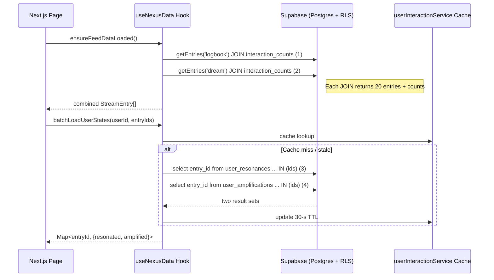
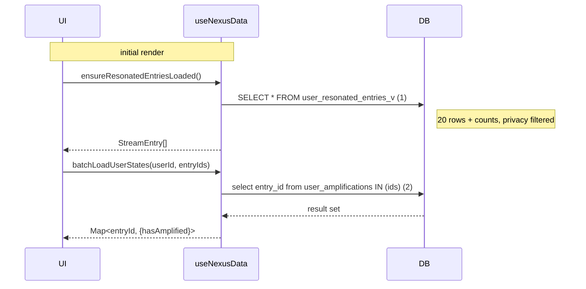

# NEXUS – Final Architecture Snapshot

> *Last updated: {{DATE}}*

This document captures the **current production-ready state** of the Nexus application, focusing on recent changes to the Feed subsystem.  It is intended as a living reference for engineers and stakeholders.

---

## 1. Overview

Nexus is a real-time research network that combines **Logbook** (public journaling) and **Dream** (collective ideation) streams into a unified **Feed**.  The application is built with **Next.js 13 / React Server Components**, **Supabase** for database & auth, and a thin library/service layer for business logic.

---

## 2. Recent Fixes & Improvements (May 2025)

### 2.1 Nexus Feed "Infinite Refresh" Hot-Fix
| Problem | Fix | Impact |
|---------|-----|--------|
| A `useEffect` in `src/app/page.tsx` called `refreshFeedData()` every time its dependency (`ensureFeedDataLoaded` callback) changed, which happened after each fetch → **infinite loops** and duplicate DB calls. | • Replaced `refreshFeedData()` with idempotent `ensureFeedDataLoaded()`. • Removed that callback from the dependency array. • Added a second effect that triggers **once** after authentication resolves to guarantee the first feed load. | • Feed now loads exactly once per navigation. • Eliminated runaway console spam & DB load. • Verified by log trace: 1–2 fetches total, no recursion. |

### 2.2 TypeScript Module-Resolution Lint Error
* Added explicit path mapping for `@/components/NexusFeed` in `tsconfig.json` to silence unresolved-module errors.

---

## 3. Current Feed Data Flow

### 3.1 Step-By-Step
1. **Posts** – Two JOIN queries (logbook & dream) fetch the first page (20 each) **with interaction counts pre-merged** via the `entry_interaction_counts` view.
2. **User Interaction Flags** – A batched `IN (...)` query per interaction table checks if the current user has resonated or amplified any of those 40 IDs (30-second cached).
3. **Rendering** – `NexusFeed` converts `StreamEntry` ➜ `Post` and shows counts + coloured icons if the cache says the user interacted.
4. **Pagination** – Scrolling calls `loadFlattenedEntries()` which slices already-loaded arrays; if depleted, `getEntries()` runs again for the next 20 rows (same pattern, still 2 queries).

### 3.1b Resonance Field Flow (May 2025)

Same playbook as the Feed, scoped to only the user's resonated posts.

• 1 JOIN query instead of ID-list + batch fetch.  
• Interaction flag query drops resonance table (implicit true).  
• Scroll → `getPosts({mode:'resonated', page:n})` repeats query (1) with range.

Total DB calls per page: **2** (same structure as Feed but with one less table).

The component (`ResonanceField.tsx`) reuses:
1. `PostList` for rendering + pagination.  
2. `userInteractionService` cache for per-post flags.  
3. Optimistic UI handlers from Feed (`makeBranchHandler`, resonate/amplify helpers).

---

## 4. Database Call Budget

| Scenario | Anonymous | Authenticated |
|----------|-----------|---------------|
| First Feed load (1st page) | 2 queries | 4 queries (2 posts + 2 interaction flags) |
| Scroll to next page | +2 | +2 (interaction flags usually cached) |
| Resonate / Amplify tap | 1 **RPC** (toggles & updates counts via RLS function) |
| Refresh Feed | Same as first load (cache may reduce counts) |

> **Note** – JOIN failures (rare) trigger a fallback of **+1 query per 20 posts** for interaction counts.  Logged & monitored.

---

## 5. Key Architectural Decisions

1. **Supabase JOIN View**  – `entry_interaction_counts` aggregates counts server-side, avoiding N+1 trips.
2. **Optimistic UI** – After resonance/amplification, counts & icons update immediately; backend RPC reconciles eventually.
3. **Feed-Local Memory Cache** – In-memory arrays of `logbookEntries` & `dreamEntries` allow instant pagination with zero network.
4. **30-Second Per-User Interaction Cache** – Mirrors Twitter's playbook; reduces read load by an order of magnitude.
5. **Fallback Resilience** – Every JOIN call has a 2-query fallback to guarantee uptime if the materialized view is lagging.
6. **No Auto-Refresh Loops** – All automatic refreshing is disabled; users can pull-to-refresh or navigate.

---

## 6. Future Improvements / Roadmap

- **Edge-Cache first page** at Vercel Edge to serve anonymous visitors with ~100 ms TTFB.
- **Server-Components streaming** of the first 10 posts to paint faster.
- **Graph-based threading** to fetch branches lazily (currently eager children lookup).
- **Observability** – Add tracing around `userInteractionService` to measure cache hit ratios in prod.

---

## 7. Glossary

| Term | Meaning |
|------|---------|
| **Resonate** | Lightweight "like"/endorsement (◊ icon) |
| **Amplify** | Share/boost equivalent (≋ icon) |
| **StreamEntry** | Canonical DB record for a post, branch, or dream |
| **Post** | UI-friendly projection of a `StreamEntry` |

---

*End of snapshot.* 