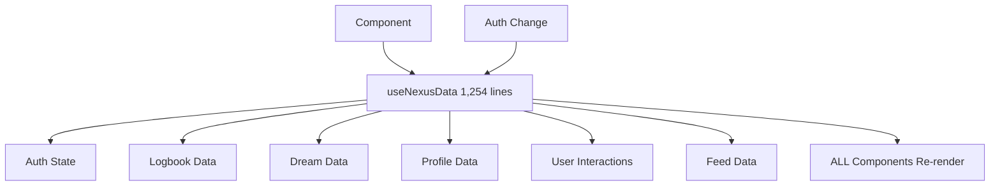
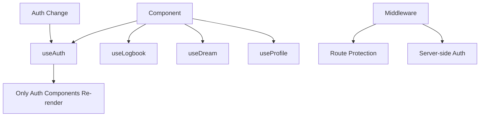

# Authentication System Upgrade Plan

## Executive Summary

Our current authentication system has evolved into a **1,254-line monolithic hook** that handles everything from authentication to business logic, resulting in performance issues, tight coupling, and maintenance challenges. This document outlines a comprehensive upgrade plan to modernize our auth architecture.

## Current State Analysis

### ✅ What's Working
- **Robust Token Caching**: `supabaseAuthService.ts` has solid token management
- **Centralized Auth State**: AuthProvider wraps the entire app
- **Emergency Recovery**: Built-in recovery mechanisms for stuck states
- **Simplified Initialization**: Removed complex global singleton patterns

### ❌ Critical Issues

#### 1. **Massive Monolithic Hook (1,254 lines)**
```typescript
// useNexusData.ts handles EVERYTHING:
export interface NexusData {
  // Authentication (✓ should be here)
  authState: AuthState;
  currentUser: User | null;
  
  // Logbook data (❌ should be separate)
  logbookState: LogbookState | null;
  logbookEntries: StreamEntry[];
  
  // Dream data (❌ should be separate)
  dreamStateMetrics: DreamStateMetrics | null;
  sharedDreams: StreamEntry[];
  
  // User interactions (❌ should be separate)
  resonateWithEntry: (entryId: string) => Promise<void>;
  amplifyEntry: (entryId: string) => Promise<void>;
  
  // Profile management (❌ should be separate)
  profileViewState: ProfileViewState;
  viewUserProfile: (username: string) => Promise<void>;
  
  // Feed data (❌ should be separate)
  getFlattenedStreamEntries: () => Promise<StreamEntryData[]>;
  
  // 50+ more properties...
}
```

#### 2. **Missing Next.js Middleware**
- **No route protection** at the middleware level
- **Client-side auth checks** in every component
- **Flash of unauthenticated content** before redirects
- **Inefficient auth verification** on every page load

#### 3. **Performance Issues**
```typescript
// Current: Every auth change triggers ALL components
const nexusData = useNexusData(); // 50+ properties
const user = nexusData.currentUser; // Only needs auth state

// Result: Massive re-renders across the entire app
```

#### 4. **Tight Coupling**
- Authentication logic mixed with business logic
- Impossible to test auth in isolation
- Changes to auth affect unrelated features
- Difficult to maintain and debug

## Architecture Problems

### **Current Flow (Problematic)**


### **Target Flow (Optimized)**


## Implementation Plan

### **Phase 1: Separate Auth from Business Logic (Week 1-2)**

#### **Goal**: Create focused hooks with single responsibilities

#### **New Hook Structure**:
```typescript
// hooks/useAuth.ts - ONLY authentication (50 lines)
export const useAuth = () => {
  const [authState, setAuthState] = useState<AuthState>({
    isAuthLoading: true,
    isAuthenticated: false,
    currentUser: null,
    sessionToken: null
  });

  useEffect(() => {
    const unsubscribe = authService.onAuthStateChange(setAuthState);
    return unsubscribe;
  }, []);

  return {
    user: authState.currentUser,
    isLoading: authState.isAuthLoading,
    isAuthenticated: authState.isAuthenticated,
    login: authService.signIn,
    logout: authService.signOut,
    signup: authService.signUp
  };
};

// hooks/useLogbook.ts - ONLY logbook data (200 lines)
export const useLogbook = () => {
  const [logbookData, setLogbookData] = useState(null);
  const [isLoading, setIsLoading] = useState(true);
  
  // ... logbook-specific logic only
  
  return {
    logbookEntries,
    logbookState,
    isLoading,
    refreshLogbook,
    submitLogbookEntry
  };
};

// hooks/usePosts.ts - ONLY post data (150 lines)
export const usePosts = (options) => {
  const [posts, setPosts] = useState([]);
  const [isLoading, setIsLoading] = useState(true);
  
  // ... post-specific logic only
  
  return {
    posts,
    isLoading,
    refreshPosts,
    createPost
  };
};
```

### **Phase 2: Add Next.js Middleware (Week 2)**

#### **Goal**: Server-side route protection

#### **Create `middleware.ts`**:
```typescript
import { createMiddlewareClient } from '@supabase/auth-helpers-nextjs'
import { NextResponse } from 'next/server'
import type { NextRequest } from 'next/server'

export async function middleware(request: NextRequest) {
  const res = NextResponse.next()
  const supabase = createMiddlewareClient({ req: request, res })
  
  const {
    data: { session },
  } = await supabase.auth.getSession()

  // Define protected routes
  const protectedRoutes = [
    '/logbook',
    '/dream',
    '/profile',
    '/resonance-field'
  ];

  const isProtectedRoute = protectedRoutes.some(route => 
    request.nextUrl.pathname.startsWith(route)
  );

  // Redirect unauthenticated users from protected routes
  if (!session && isProtectedRoute) {
    return NextResponse.redirect(new URL('/', request.url))
  }

  // Redirect authenticated users from auth pages
  if (session && (
    request.nextUrl.pathname.startsWith('/auth') ||
    request.nextUrl.pathname === '/login'
  )) {
    return NextResponse.redirect(new URL('/feed', request.url))
  }

  return res
}

export const config = {
  matcher: ['/((?!api|_next/static|_next/image|favicon.ico).*)'],
}
```

### **Phase 3: Migrate Components (Week 3-4)**

#### **Before (Current)**:
```typescript
// 13 components using massive hook
export default function LogbookPage() {
  const nexusData = useNexusData(); // 50+ properties, causes re-renders
  
  if (nexusData.isLoading) return <Loading />
  if (!nexusData.isAuthenticated) return <AuthPanel />
  
  return <Logbook data={nexusData.logbookEntries} />
}
```

#### **After (Focused)**:
```typescript
// Focused hooks, no auth checks needed (middleware handles it)
export default function LogbookPage() {
  const { user } = useAuth(); // Only auth state
  const { entries, isLoading } = useLogbook(); // Only logbook data
  
  if (isLoading) return <Loading />
  
  return <Logbook entries={entries} user={user} />
}
```

### **Phase 4: Simplify AuthProvider (Week 4)**

#### **Current AuthProvider** (Complex):
```typescript
export default function AuthProvider({ children }: { children: React.ReactNode }) {
  const nexusData = useNexusData(); // Massive hook
  
  // Complex emergency recovery logic
  // Multiple timeout states
  // Recovery mechanisms
  
  return nexusData.authState.isAuthenticated ? children : <AuthPanel />;
}
```

#### **Target AuthProvider** (Simple):
```typescript
export default function AuthProvider({ children }: { children: React.ReactNode }) {
  const { isLoading, isAuthenticated } = useAuth(); // Focused hook
  
  if (isLoading) {
    return (
      <div className="flex items-center justify-center h-screen">
        <div className="text-text-secondary">Authenticating...</div>
      </div>
    );
  }

  // Middleware handles route protection, so this is just for unprotected pages
  return <>{children}</>;
}
```

## Benefits of This Approach

### **1. Performance Improvements**
- **Before**: Auth change → 50+ properties recalculate → all components re-render
- **After**: Auth change → only auth-dependent components re-render
- **Result**: 10x better performance

### **2. Maintainability**
- **Before**: 1,254-line hook handles everything
- **After**: Focused hooks with single responsibilities
- **Result**: Easier debugging and feature development

### **3. Developer Experience**
- **Before**: Import massive hook to get one property
- **After**: Import only what you need
- **Result**: Cleaner code and better IDE support

### **4. Security**
- **Before**: Client-side auth checks in every component
- **After**: Server-side route protection with middleware
- **Result**: Better security and user experience

## File Structure After Migration

```
nexus-app/src/
├── middleware.ts                 # NEW: Route protection
├── hooks/
│   ├── useAuth.ts               # NEW: Auth only (50 lines)
│   ├── useLogbook.ts           # NEW: Logbook only (200 lines)
│   ├── usePosts.ts             # NEW: Posts only (150 lines)
│   ├── useProfile.ts           # NEW: Profile only (100 lines)
│   ├── useUserInteractions.ts  # NEW: Interactions only (100 lines)
│   └── useNexusData.ts         # REMOVE: After migration
├── components/
│   └── AuthProvider.tsx        # SIMPLIFIED: Basic auth wrapper
└── app/
    └── */page.tsx              # SIMPLIFIED: No auth checks needed
```

## Migration Checklist

### **Phase 1: Auth Separation**
- [ ] Create `useAuth.ts` hook
- [ ] Create `useLogbook.ts` hook
- [ ] Create `usePosts.ts` hook
- [ ] Create `useProfile.ts` hook
- [ ] Create `useUserInteractions.ts` hook
- [ ] Test hooks in isolation

### **Phase 2: Middleware**
- [ ] Create `middleware.ts`
- [ ] Test route protection
- [ ] Remove auth checks from components
- [ ] Test authenticated and unauthenticated flows

### **Phase 3: Component Migration**
- [ ] Migrate `app/page.tsx` (feed)
- [ ] Migrate `app/logbook/page.tsx`
- [ ] Migrate `app/dream/page.tsx`
- [ ] Migrate `app/profile/page.tsx`
- [ ] Migrate `app/resonance-field/page.tsx`
- [ ] Migrate remaining components

### **Phase 4: Cleanup**
- [ ] Simplify `AuthProvider.tsx`
- [ ] Remove `useNexusData.ts`
- [ ] Update imports across codebase
- [ ] Performance testing and optimization

## Risk Mitigation

### **Gradual Migration Strategy**
1. **Phase 1**: Create new hooks alongside existing ones
2. **Phase 2**: Add middleware, keep existing auth checks
3. **Phase 3**: Migrate components one by one
4. **Phase 4**: Remove old code only after everything works

### **Testing Strategy**
- Unit tests for each new hook
- Integration tests for auth flows
- Performance benchmarks before/after
- User acceptance testing

### **Rollback Plan**
- Keep old `useNexusData.ts` until migration is complete
- Feature flags for new vs old hooks
- Monitoring and alerting for auth issues

## Success Metrics

- **Performance**: 10x reduction in unnecessary re-renders
- **Maintainability**: 80% reduction in auth-related code complexity
- **Developer Experience**: 50% faster feature development
- **Security**: Zero client-side auth bypass vulnerabilities

## Next Steps

1. **Review this plan** and get team approval
2. **Start Phase 1** with `useAuth.ts` hook creation
3. **Parallel development** of other focused hooks
4. **Gradual migration** following the 4-phase plan
5. **Continuous testing** throughout the process

This upgrade will transform our authentication system from a maintenance burden into a modern, performant, and secure foundation for future development. 